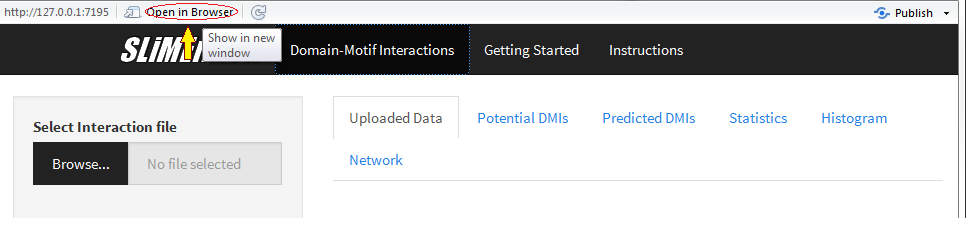

**The SLiMEnrich App allows users to predict Domain-Motif Interactions from PPI data and to analyze enrichment**

- *SLiMEnrich* can be tested using the test/example data available in `example` folder.

# **Instructions**

Shiny App can be called from any R enrvironment such as `RStudio`. 

## *Prerequisites*

Open `app.R` file in any R environment and install required packages.

### *Input Data* 

You may use this app by

1. Loading test data available in `example` folder.
2. Upload your own dataset which requires four files
     
  * PPI file. The order of columns in the file should be:
          ---
            `(Column 1) ELM Proteins | (Column 2) Domain Proteins`
            
  * Domain file (File generated by SLiMBench is available in `example` folder)
  * ELM-Pfam file (File downloaded from ELMdb is available in `example` folder)
  * SLiMs file (e.g. SLiMprob output file `slimprob.occ.csv`)

### *Data Format* 

- Must be a .CSV *comma-separated-value* or .tsv *tab-separated-value* file.
- All files must be in same format as available in `example` folder

### *Download data/plots*

- Download buttons work when app is opened in browser.

---

